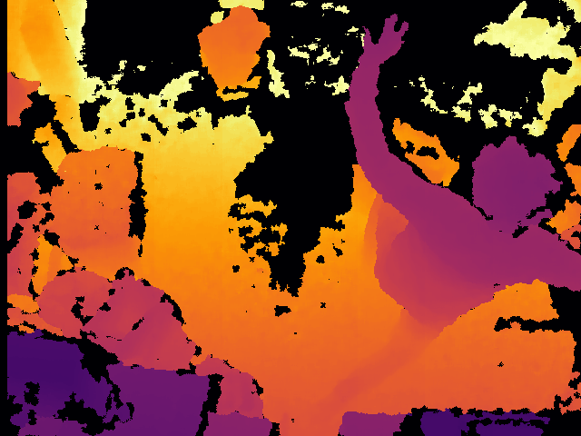
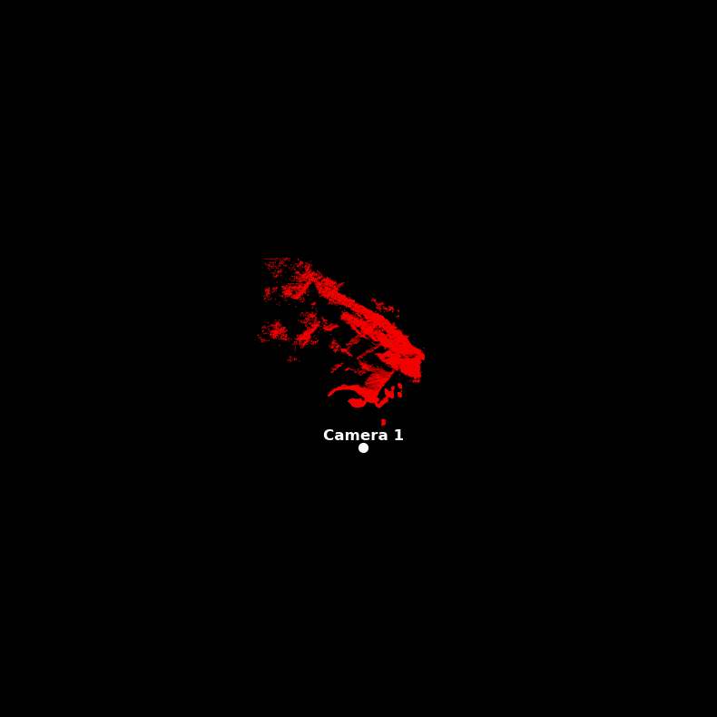
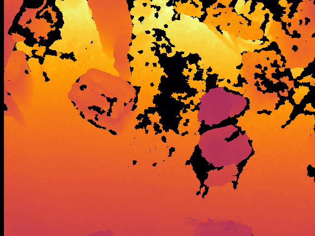
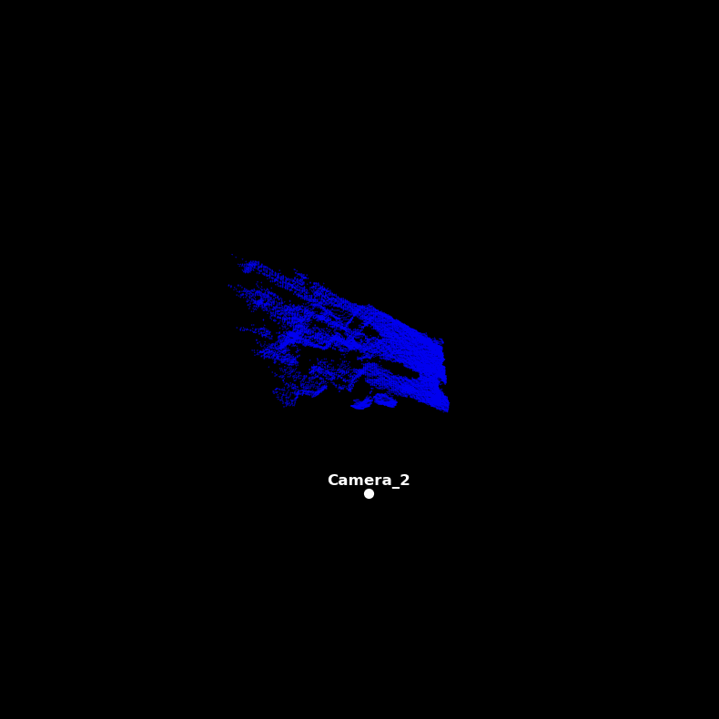
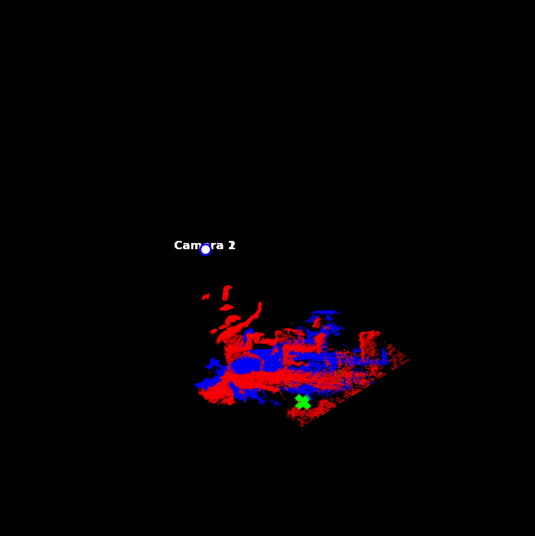
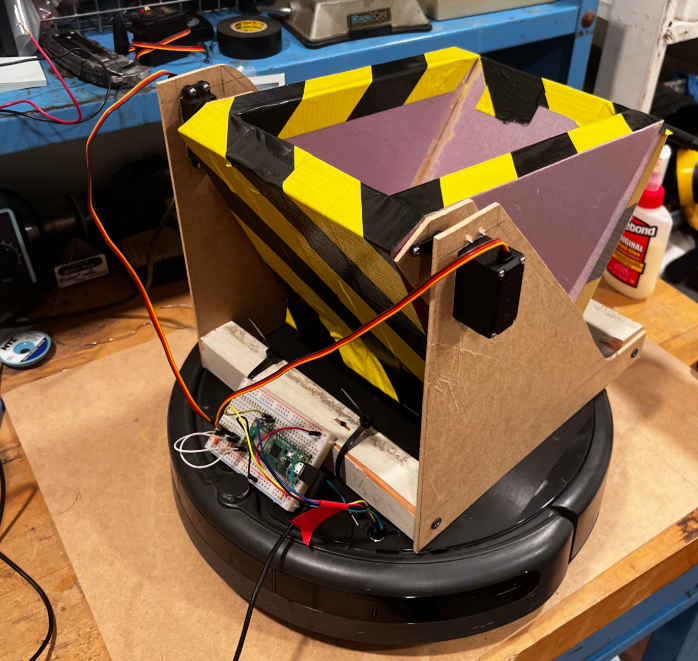

# [WIP] Beverage Issuing and Extraction Robot (BIERBot)
### This project seeks to develop a personal home beverage attendant, able to navigate home environments, deliver beverages to residents, and deposit empty beverage receptacles in recycling bins.
#### Created by Sam Klemic

Further project goals include utilizing low-cost hardware, developing a dynamic computer vision platform adaptable to any room, and incorporating more advanced computer vision techniques in the future (i.e. Object vs Person classification, Identifying empty beverage receptacles, etc.).

## Room Sensing

3D point cloud images of a given room is captured using two Xbox 360 Kinects. Kinects are interfaced with using [PyKinect](https://github.com/microsoft/ptvs/wiki/PyKinect). Infrared depth images from individual Kinects provide distance data for each pixel in frame relative to the sensor. Using the Kinect camera's intrinsic matrix, we transform these distance pixels to point clouds, with the Kinect positioned as the origin.

Depth Heatmap from Cameras 1 and 2:

| Depth Heatmap | 3D Point Cloud |
| ----------- | ----------- |
|  |  |
|  |  |

We calibrate the coordinate spaces of the two camera point clouds by identifying three non-colinear corresponding points within the room. Using the [Kabsch algorithm](https://hunterheidenreich.com/posts/kabsch-algorithm/), we compute the rigid transformation, in the form of a rotation matrix and a translation vector. This transformation is applied to one of the point clouds to align it with the other, enabling unified 3D sensing of the space.

By selecting the three calibration points to all lie on the floor of the room, we can also identify a plane within the space that corresponds to the floor. With this floor plane determined, we can easily idenify which points correspond with obstacles. We make this discrimination by checking if the orthogonal distance between a given point and the floor plane falls within a user-determined threshold.

## Obstacle Detection

Idenfiying the points that are within a given threshold from the floor is our first step in identifying the navigable space in the room. In practice, the Kinect IR Sensor can be noisy, leading to inaccuracy in depth data. In order to discriminate between noise and an actual obstacle, we employ a cluster detection algorithm, namely DBSCAN. DBSCAN was selected because it is lightweight enough to run in real time and can accurately differentiable between points belonging to obstacles and noise from the Kinect sensor.

DBSCAN cluster labels can change at any given frame. As such an additional persistent cluster tracking system was implemented, which maps each new frame's cluster against previously seen ones. If new frame clusters fall within the same general area as previous cluster they get mapped together. Additionally if clusters haven't been seen over a given amount of time they get pruned from the tracking dict.
With these two techniques employed we can identify obstacles within the room, and more importantly, identify where in the room our robot can actually navigate.

## Delivery Robot and Beverage Dispenser

iRobot, the company which produces Roomba vacuum cleaners, also supports open source and maker projects. As such, on many Roomba models there is a 7 pin serial communication port underneath their top panel. This port enables full control over the motors, sensors, and routines of the Roomba device ([Serial Communication Open Interface](https://cdn-shop.adafruit.com/datasheets/create_2_Open_Interface_Spec.pdf)). Because used Roombas are relatively inexpensive and can be controlled through this OI, they are ideal for this project.

Similarly inexpensive are Raspberry Pi Pico W, which are able to communicate with the Roomba's OI through their UART TX and RX pins. In this project, a Raspberry Pi Pico W hosts a small local server over WiFi which takes commands from our vision system computer, translates them into serial commands, and instructs the Roomba's movement.

Here is an early development example of the Roomba being commanded wirelessly through the Pico W:

The Pico W commanded Roomba and the vision system will be responsible for physically transporting beverages to various locations in the room. In order to retrieve the beverage in the first place, a prototype beverage dispenser was designed. This dispenser also operates using a Pico W, likewise hosting a small WiFi server to control a MG995 servo motor. The wheel which grasps incoming beverages was constructed out of pink foam insulation board, attached to a commercially available [can dispenser](https://www.containerstore.com/s/kitchen/refrigerator-freezer/pitchers-and-beverage-storage/beverage-can-dispenser/123d?productId=11010397) with scrap 1/8" particle board:

The idea is to situate this dispenser above the Roomba Charging dock. The Roomba senses two wavelengths of IR light to position itself automatically into it's charging station ([See page 24 of OI spec](https://cdn-shop.adafruit.com/datasheets/create_2_Open_Interface_Spec.pdf#page=24)). This means that it would able to consistently position itself beneath our dispenser, always facing the same direction. This makes the charging dock ideal as a staging ground for the Roomba to begin it's delivery.

A shaped bucket on top of the Roomba could safely catch dispensed beverages and cradle them during delivery. An intial design and protoype for this bucket was made and can be seen below. The idea with this design was to be able to store up to 6 beverages at once, and be able to dump empty beverages (meeting the Recycling goal of the project) by flipping the bucket around it's connection to the frame. However, due to current draw and load limitations of the servo motors, this design cannot operate reliably without an external power source. As such, a redesign is preferred over modifying this inefficient approach.

## Continued Work

#### Presently, the Roomba model is no longer responding to Serial communications so troubleshooting that is first priority. 

Next is further implementing the algorithm for tracking the Roomba within our room image. The current plan is to maintain a persistent file of the Roomba's normalized point cloud, and check each tracked cluster against it. The metric to be used for checking a cluster's similarity to the Roomba is Chamfer distance. For each track we can maintain an exponential moving average of its Chamfer distance to the normalized Roomba points which ideally would help smooth random clusters occasionally winning out over the actual Roomba cluster. Additionally, if the Roomba bucket redesign can have a relatively unique shape to the kinds of objects found in a room, this metric would be more effective at identifying it.

Following this, implement a path following protocol for the Roomba to use. At the moment, A* is implemented within the vision system to find the most optimal path between two points within the room image. It uses Euclidiean distance to the goal as a heuristic. It builds the navigation space marking the convex hulls of obstacle clusters as high cost traversal. Through basic testing it seems to work well. The next step would be to break down the computed A* path into the points in which the path curves or turns, and treat them as check points.

The forward facing direction of the Roomba can be calibrated after it leaves the charging dock by marking it's position, driving a short distance forward, and marking it's new position. Following that, rotating the Roomba to face the next checkpoint and drive until it's cluster centroid is within a given distance. Continue this until the destination is reached. For returning to the dock, spin the Roomba completely around and follow the path backwards.

Other considerations with path finding include what to do if an obstace interupts the path. In this case, we would likely recalculate the A* path with the new obstacle clusters starting from the Roomba's current position.